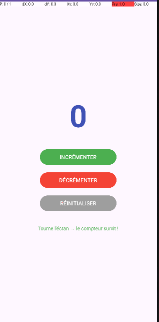

#  LAB 18 : ViewModel et LiveData en Android

> **Cours** : Programmation Mobile — Android avec Java  
> **Étudiant** : Sara Jamiri  


---

##  Objectifs

- Comprendre pourquoi une variable classique est **perdue** à chaque rotation d'écran
- Voir la limite de `onSaveInstanceState()` (ancienne méthode)
- Maîtriser **ViewModel** (survit à la destruction/re-création de l'Activity)
- Maîtriser **LiveData** (lifecycle-aware : met à jour l'UI seulement quand l'Activity est active)
- Découvrir : `LifecycleOwner`, `Observer`, `ViewModelStore`, `MutableLiveData` vs `LiveData`, `setValue` vs `postValue`

---

##  Démonstration



> Le compteur affiche **0** au démarrage. Après incrémentation, la valeur **survit à la rotation d'écran** grâce au ViewModel.

---

##  Théorie rapide

Quand vous tournez l'écran, Android :

1. **Détruit** l'Activity actuelle (`onDestroy`, `onSaveInstanceState`)
2. **Recrée** une nouvelle Activity (`onCreate`)
3. Toutes les variables d'instance sont **perdues** (sauf si sauvegardées manuellement)

| Solution | Limite |
|---|---|
| `onSaveInstanceState` | Seulement types primitifs, pas d'objets complexes |
| **ViewModel**  | Survit à la rotation, garde n'importe quel objet en mémoire |
| **LiveData**  | Observable lifecycle-aware → zéro crash, zéro memory leak |

> C'est le fondement du pattern **MVVM** (Model-View-ViewModel) recommandé par Google depuis 2018.

---

##  Structure du projet

```
app/
└── src/main/
    ├── java/com/sara/viewmodellivedatademoenrichi/
    │   ├── MainActivity.java         ← UI + Observer LiveData
    │   └── CounterViewModel.java     ← Logique métier + MutableLiveData
    └── res/layout/
        └── activity_main.xml         ← 3 boutons + TextView compteur
```

---

##  Dépendances (`build.gradle.kts` Module :app)

```kotlin
val lifecycle_version = "2.8.7"
implementation("androidx.lifecycle:lifecycle-viewmodel:$lifecycle_version")
implementation("androidx.lifecycle:lifecycle-livedata:$lifecycle_version")
```

---

##  Concepts clés

### CounterViewModel.java
```java
public class CounterViewModel extends ViewModel {
    private final MutableLiveData<Integer> count = new MutableLiveData<>();

    public CounterViewModel() { count.setValue(0); }

    public MutableLiveData<Integer> getCount() { return count; }
    public void increment() { count.setValue(count.getValue() + 1); }
    public void decrement() { count.setValue(count.getValue() - 1); }
    public void reset()     { count.setValue(0); }
}
```

### MainActivity.java — Observer pattern
```java
// Obtenir le ViewModel (survit aux rotations)
viewModel = new ViewModelProvider(this).get(CounterViewModel.class);

// Observer : UI mise à jour automatiquement
viewModel.getCount().observe(this, newCount -> {
    tvCount.setText(String.valueOf(newCount));
});
```

---

##  Flux de données (MVVM)

```
User clique → MainActivity → ViewModel.increment()
                                     ↓
                            MutableLiveData.setValue()
                                     ↓
                            Observer notifié → tvCount mis à jour
```

---

##  Scénarios testés

| Scénario | Sans ViewModel | Avec ViewModel  |
|---|---|---|
| Rotation d'écran |  Compteur remis à 0 |  Valeur conservée |
| Changement de thème |  Perte des données |  Valeur conservée |
| App en background |  Possible crash | LiveData suspend les notifs |

---

##  Lancer le projet

1. Cloner le repo
2. Ouvrir dans **Android Studio** (`File → Open`)
3. Attendre la sync Gradle
4. Cliquer ▶ **Run** sur un émulateur ou appareil (API 24+)
